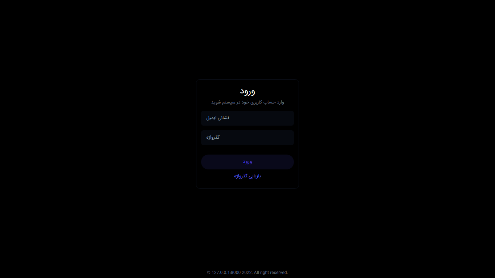
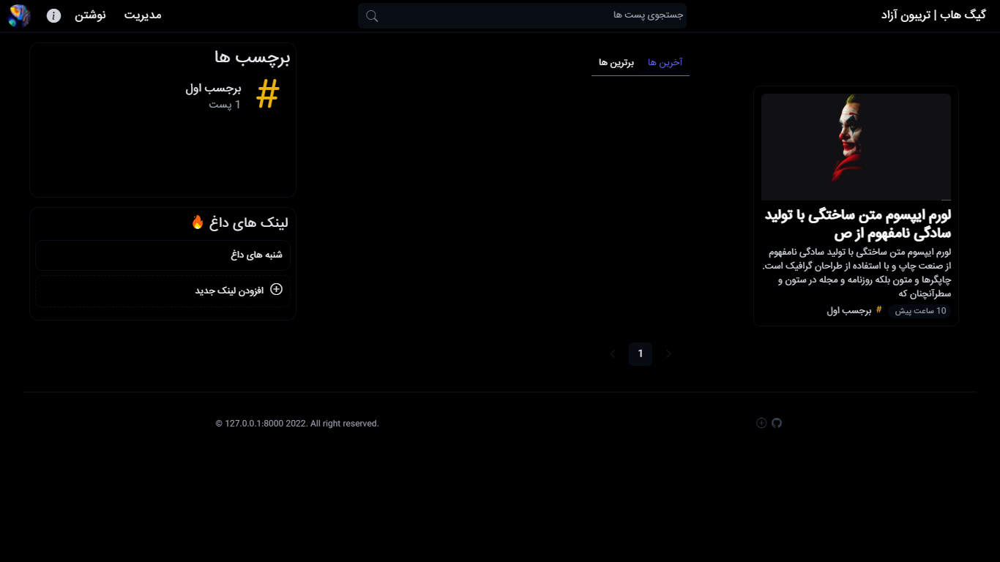
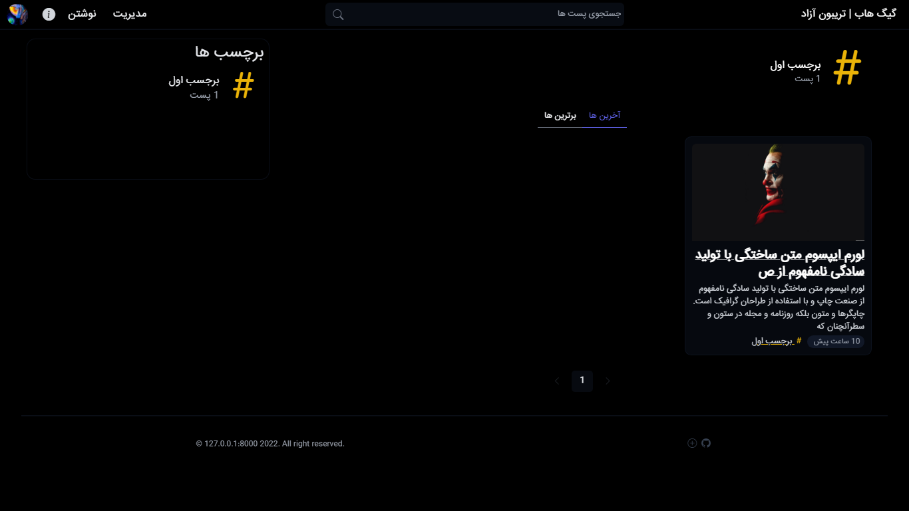
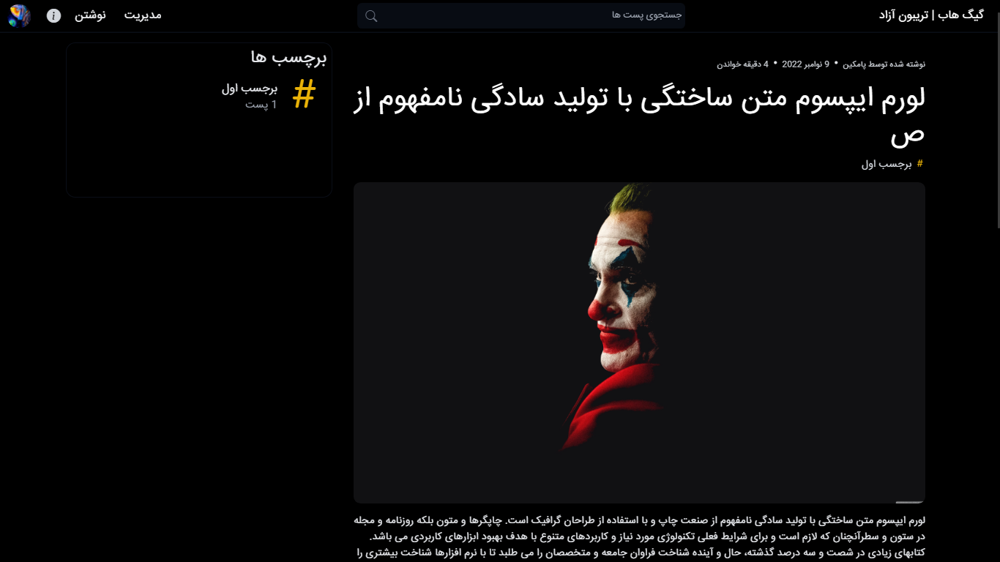

# GEEKHUB Project

Geekhub project is a simple persian blog system using email authentication and markdown to show posts. You can set the name and blog theme also add your links. Every one can login. Each author's posts need to be approved by the site administrator to be published. We can also use tags so users can find related posts much better.

## Login page

## Index page

## Hashtag page

## Post page

